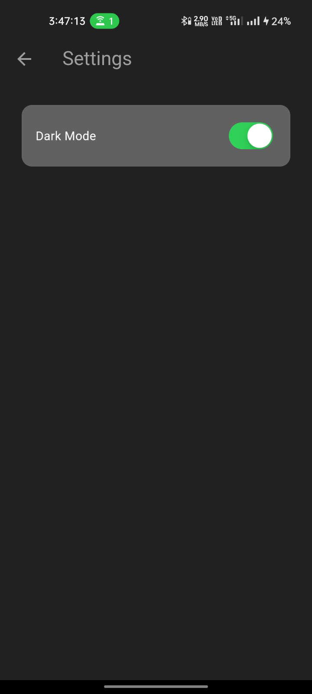

# Minimal Chat App

A real-time chat application built with Flutter and Firebase. This app allows users to communicate instantly with each other, supporting features like authentication, real-time messaging, dark/light mode, and more.

## Table of Contents

- [Features](#features)
- [Screenshots](#screenshots)
- [Getting Started](#getting-started)
  - [Prerequisites](#prerequisites)
  - [Installation](#installation)
  - [Firebase Configuration](#firebase-configuration)
- [Usage](#usage)
- [Folder Structure](#folder-structure)
- [Dependencies](#dependencies)
- [Contributing](#contributing)
- [License](#license)

## Features

- **Real-time Messaging:** Send and receive messages instantly with Firebase Firestore.
- **User Authentication:** Secure sign-up and login using Firebase Authentication.
- **Dark/Light Mode:** Toggle between dark and light themes for better user experience.
- **Responsive UI:** Adaptive layouts for different screen sizes and orientations.
- **User Presence:** Display online/offline status of users (can be implemented).
- **Profile Management:** Allow users to update and manage their profiles (can be extended).
- **Push Notifications:** Receive notifications for new messages (can be integrated).

## Screenshots

<!-- Add screenshots of your app here -->
<p align="center">
  
  
  
  
  
</p>

## Getting Started

Follow these instructions to get a copy of the project up and running on your local machine for development and testing purposes.

### Prerequisites

- **Flutter SDK:** [Install Flutter](https://flutter.dev/docs/get-started/install) on your machine.
- **Firebase Account:** Create a Firebase project at [Firebase Console](https://console.firebase.google.com/).
- **Code Editor:** Use any IDE or code editor of your choice (e.g., VS Code, Android Studio).

### Installation

1. **Clone the Repository**
   ```bash
   git clone https://github.com/sumo47/RealtimeChat.git
   ```
2. **Navigate to Project Directory**
   ```bash
   cd RealtimeChat
   ```
3. **Install Dependencies**
   ```bash
   flutter pub get
   ```
4. **Configure Firebase**
   - Follow the [Firebase Configuration](#firebase-configuration) steps below.

5. **Run the App**
   ```bash
   flutter run
   ```

### Firebase Configuration

1. **Create a Firebase Project**
   - Go to [Firebase Console](https://console.firebase.google.com/) and create a new project.

2. **Add Android App**
   - Register your app with a unique package name (e.g., `com.example.minimal_chat_app`).
   - Download the `google-services.json` file and place it in the `android/app` directory.

3. **Add iOS App (Optional)**
   - Register your iOS app and download the `GoogleService-Info.plist` file.
   - Place the file in the `ios/Runner` directory.
   - Ensure you have the necessary iOS setup in your Flutter project.

4. **Enable Authentication**
   - In the Firebase Console, go to **Authentication** and enable **Email/Password** sign-in method.

5. **Setup Firestore Database**
   - In the Firebase Console, go to **Firestore Database** and create a new database in production or test mode.

6. **Initialize Firebase in Flutter**
   - The Firebase initialization is handled in `main.dart` using the `firebase_options.dart` file generated by `flutterfire` CLI.
   - Run the following command to generate `firebase_options.dart`:
     ```bash
     flutterfire configure
     ```
   - Follow the prompts to select your Firebase project and platforms.

## Usage

- **Register Account:** Open the app and register with your email and password.
- **Login:** Use your credentials to log in to the app.
- **Chat:** Start chatting with other registered users in real-time.
- **Toggle Theme:** Go to settings and switch between dark and light modes.
- **Logout:** Use the drawer menu to log out of your account.

## Folder Structure

```
minimal_chat_app/
├── lib/
│   ├── components/
│   │   ├── chat_bubble.dart
│   │   ├── my_button.dart
│   │   ├── my_drawer.dart
│   │   ├── my_textfield.dart
│   │   └── user_tile.dart
│   ├── models/
│   │   └── message.dart
│   ├── pages/
│   │   ├── chat_page.dart
│   │   ├── home_page.dart
│   │   ├── login_page.dart
│   │   ├── register_page.dart
│   │   └── settings_page.dart
│   ├── services/
│   │   ├── auth/
│   │   │   ├── auth_gate.dart
│   │   │   ├── auth_service.dart
│   │   │   └── login_or_register.dart
│   │   └── chat/
│   │       └── chat_service.dart
│   ├── themes/
│   │   ├── dark_mode.dart
│   │   ├── light_mode.dart
│   │   └── theme_provider.dart
│   ├── firebase_options.dart
│   └── main.dart
├── pubspec.yaml
└── README.md
```

### Description of Important Files and Directories

- **components/**: Contains reusable UI components such as buttons, text fields, and chat bubbles.
- **models/**: Defines data models used in the app, like the `Message` model.
- **pages/**: Contains the main screens/pages of the app such as login, registration, chat, home, and settings pages.
- **services/**: Includes services for authentication and chat functionality interacting with Firebase.
- **themes/**: Contains theme configurations for dark and light modes along with a theme provider for state management.
- **firebase_options.dart**: Auto-generated file containing Firebase configuration options.
- **main.dart**: Entry point of the application where Firebase is initialized and the app is started.

## Dependencies

The project uses the following major dependencies:

- [flutter](https://flutter.dev/)
- [firebase_core](https://pub.dev/packages/firebase_core)
- [firebase_auth](https://pub.dev/packages/firebase_auth)
- [cloud_firestore](https://pub.dev/packages/cloud_firestore)
- [provider](https://pub.dev/packages/provider)
- [cupertino_icons](https://pub.dev/packages/cupertino_icons)

Refer to the `pubspec.yaml` file for the complete list and versions.

## Contributing

Contributions are welcome! Please follow these steps:

1. **Fork the Repository**
2. **Create a Feature Branch**
   ```bash
   git checkout -b feature/YourFeature
   ```
3. **Commit Your Changes**
   ```bash
   git commit -m "Add your feature"
   ```
4. **Push to the Branch**
   ```bash
   git push origin feature/YourFeature
   ```
5. **Open a Pull Request**

Please make sure your code follows the project's coding standards and passes all tests.

## License

This project is licensed under the [AVIT License](LICENSE).

---

**Disclaimer:** This is a minimal chat application intended for educational purposes. For production use, consider implementing additional features such as enhanced security measures, user profile management, message encryption, and push notifications.

---

## Contact

For any inquiries or support, please contact [thesumitsah47@gmail.com](mailto:thesumitsah47@gmail.com).

---

*Happy Coding!* 🚀
```